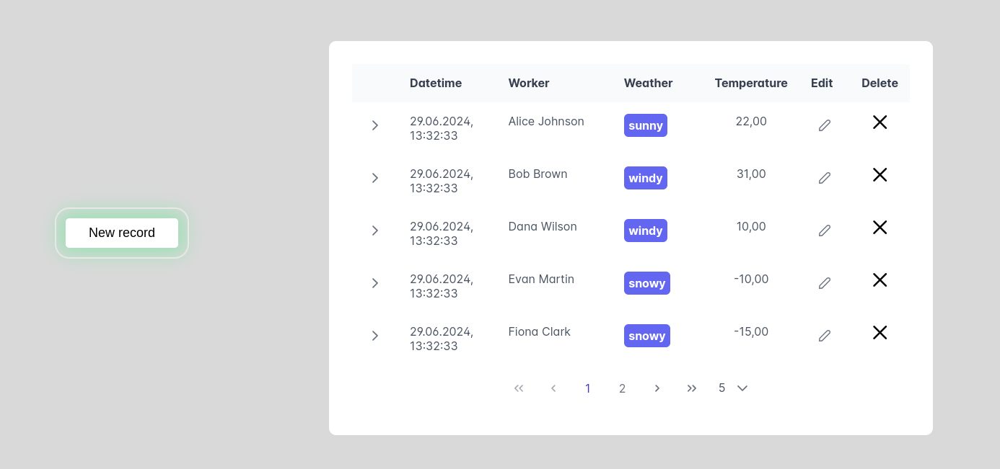
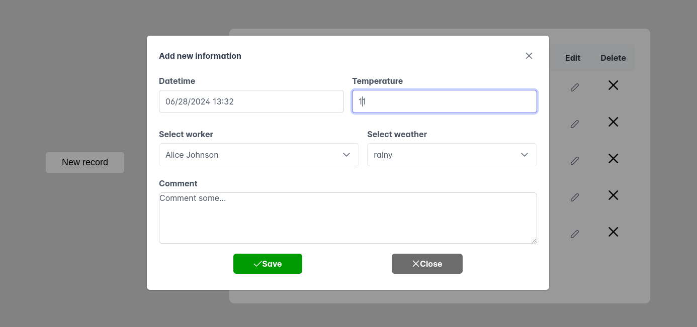
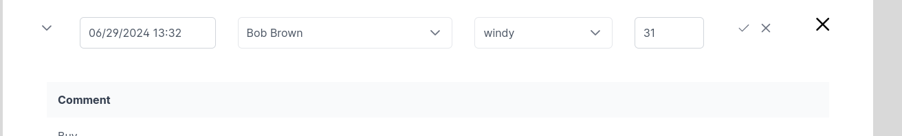
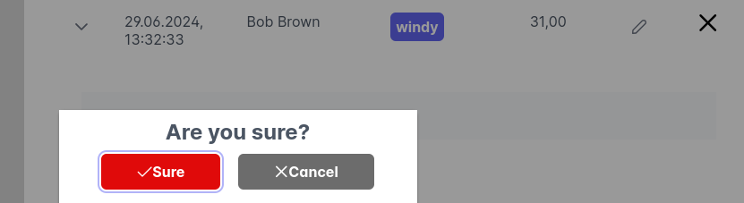

# Simple Data about weather

## Description

The user can:

- view weather information
- edit
- delete
- add a new entry

## Instruments

- React
- Typescript
- Vite
- MSW
- Eslint
- PrimeReact
- SCSS
- RTK Query

### Work MSW

- GET: get workers
- GET: get weather data
- POST: add record about weather
- PUT: change record about weather
- DELETE: delete record about weather

## View

